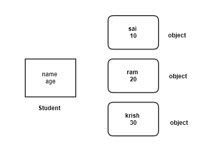
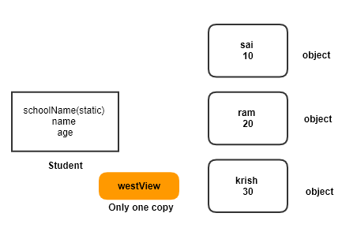

#### Things learned today
* __CRC__
    * CRC means
        * __C__ Class
        * __R__ Responsibility
        * __C__ Collaboration
    * In a project every class has a name __C__ and some responsibilities __R__ (methods) and collobarates __C__ with other classes.
    * This is like your school project where group of students are assigned for a project , and each one of you do some work in that project and at the same time takes help(collaboration) with other students

    * TOH class CRC
        * Disk 
            * C Disk
            * R draws the tower
            * C None (does not interact with any other class)
        * Tower 
            * C Tower
            * R draw the tower, add disks, remove disks and give the disk back
            * C collaborates with Disk
        * Gamer
            * C Gamer
            * R creates initial setup, moves the disk from one tower to another tower, tells when the game is over
            * C collaborates with Tower, Disk
        * Application
            * C Application
            * R starts the gamer, asks the user input 
            * C collaborates with Gamer

* __Static__
    * Static in Java is "Shared across all classes"
    * Lets walk through example
        ```java
            class Student{
                String name;
                int age;
            }
        ```
    * With above class when you create 3 objects each will have its own name and age    
        
        

    * What if all the objects has a property called school name where every student belongs to the same school. Then we can share this information across all the objects and this is achieved by using __static__ keyword
        ```java
            class Student{
                static String schoolName;
                String name;
                int age;
            }
        ```
        

    * static applies to the methods also
        ```java
        class Student{
            public static void displaySchoolName(){
                System.out.println("School name:" + schoolName);
            }
        }
        ```
    * Accessing static methods and variables

        ```java
            // One uses the class name (not the object)
            System.out.println(Student.schoolName);
            Student.displaySchoolName();
        ```
        * See the different of accessing the static methods and variables. We use class (__Student__) for accessing where as non static one we use object (__s1__)

    * Class and Instance Variables
        * static variables are called __class variables__
        * non staitc variables are called __instance variables__ (remember __instance__ is another name for __object__)
    
    * Class and Instance Methods
        * same applies to the methods
    
    * In below student class
        ```java
            class Student{
                static String schoolName;
                String name;
                int age;

                static void displaySchoolName(){

                }

                void readBook(){

                }
            }
        ```

        * class variables
            * schoolName
        * class methods
            * displaySchoolName
        * instance variables
            * name
            * age
        * instance methods
            * readBook
* add Special
    * in order to understand more about this static and class and instance variables we are going to do a exercise
    * Lets create below scenario
        * There were 3 people sitting next each other (lets say A, B, C)
        * There is one instructor ( Lets say name: I)
        * In the begining 
            * __I__ gives __A__ number __1__ ( A remembers 1 in his brian)
            * __I__ gives __B__ number __2__ ( B remembers 2 in his brian)
            * __I__ gives __C__ number __3__ ( C remembers 3 in his brian)
        * Next
            * __I__ gives __A__ number __4__ 
            * __A__ gives (1+4) __5__  
            * __A__ remembers his number as __5__
        * Next
            * __I__ gives __B__ number __4__ 
            * __B__ gives (2+4) __6__  
            * __B__ remembers his number as __6__
        * Next
            * __I__ gives __A__ number __7__ 
            * __A__ gives (5+7) __12__  
            * __A__ remembers his number as __12__
    
    * we will implement this to understand more about class and instance variables and methods


